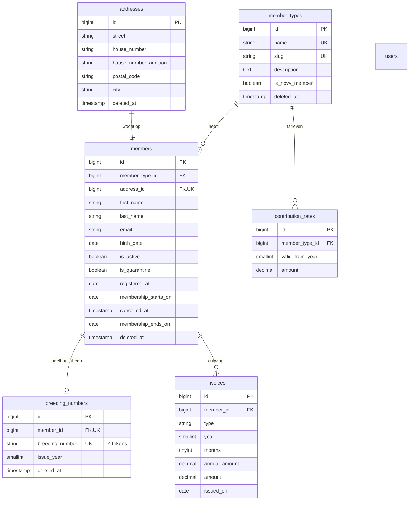

# Ledenadministratie Vogelvereniging 't Fratertje

Webapplicatie voor het beheren van leden, adressen, lidsoorten, NBvV-gegevens (kweeknummers), contributie en facturen van vogelvereniging 't Fratertje. Gebouwd met Laravel 13 volgens het MVC-patroon, met Eloquent, migrations, Form Requests, events, helpers, authenticatie en Pest-tests.

---

## Inhoud

- [Bedrijfsregels](#bedrijfsregels)
- [Gebruikte tools](#gebruikte-tools)
- [Installatie](#installatie)
- [Test-inloggegevens](#test-inloggegevens)
- [Applicatie starten](#applicatie-starten)
- [Tests draaien](#tests-draaien)
- [Databaseontwerp](#databaseontwerp)
- [Projectstructuur](#projectstructuur)
- [Belangrijkste functionaliteit](#belangrijkste-functionaliteit)
- [Ontwerpkeuzes](#ontwerpkeuzes)

---

## Bedrijfsregels

- **Lidsoorten:** volwassen lid (vanaf 18 jaar), jeugdlid (tot 18 jaar), gastlid (alle leeftijden). De leeftijdsgrenzen worden in de validatie afgedwongen.
- **Kweeknummer (= NBvV-lidnummer):** jeugd- en volwassen leden hebben verplicht een uniek kweeknummer; een gastlid heeft er **geen**. Een kweeknummer hoort bij maximaal één lid en bestaat uit precies 4 letters en/of cijfers, meestal 1 cijfer gevolgd door 3 letters (bv. `1TKY`). Afgedwongen in de database (`varchar(4)` + unieke index), in de Form Requests (`regex:/^[A-Z0-9]{4}$/`) en in `MemberService`.
- **Contributie:** volwassen € 36,00, jeugd € 18,00, gast € 18,00 per jaar. Een jeugdlid betaalt ook in het jaar waarin het 18 wordt nog het jeugdtarief (`ContributionCalculator::isYouthTariff`).
- **Ingangsdatum:** aanmelding + 3 weken, dan de eerstvolgende 1e van de maand (valt de datum precies op de 1e, dan geldt die). Contributie naar rato van de resterende maanden van dat jaar.
  - 5 maart → 26 maart → lid per 1 april → 9 maanden.
  - 25 maart → 15 april → lid per 1 mei → 8 maanden. *(In de opdracht staat "1 juni" bij 8 maanden; 1 juni zou 7 maanden zijn, dus we gaan uit van een typefout.)*
- **Aanmelden:** publiek formulier (`/aanmelden`). Het lid komt in **quarantaine** en de administratie krijgt een e-mail en ziet het op het dashboard. Het aanvinken van de verklaring geldt als digitale handtekening. Pas na *goedkeuren* wordt het lid actief en ontstaat de contributiefactuur.
- **Afmelden:** publiek formulier (`/afmelden`), identificatie met e-mailadres + geboortedatum. Wordt direct verwerkt, de administratie krijgt een e-mail en het lid krijgt een restitutiefactuur voor de resterende maanden (zelfde 3-wekenregel).
- **Soft-deletes:** er wordt niets definitief verwijderd. Leden en kweeknummers zijn terug te zien en te herstellen via de archiefweergave (vinkje "Toon verwijderde …").
- **Prijswijzigingen:** vastgelegd als tarief met ingangsjaar (`contribution_rates`); alleen een komend jaar is toegestaan. Facturen bewaren het tarief van het moment, dus historie en lopend jaar veranderen nooit.

---

## Gebruikte tools

Laravel 13 · PHP 8.4 · MySQL · Laravel Herd · Composer · npm/Vite · Tailwind CSS 4 · Pest 5 · Laravel Pint · Laravel Boost · Git

---

## Installatie

Vereist: PHP 8.3+, Composer, Node.js/npm, MySQL (bijvoorbeeld via [Laravel Herd](https://herd.laravel.com/)).

```bash
git clone <repository-url> t-fratertje
cd t-fratertje
composer install
npm install
npm run build
cp .env.example .env
php artisan key:generate
```

Maak een lege MySQL-database `fratertje` aan en controleer de instellingen in `.env` (er staan geen wachtwoorden in de broncode):

```env
DB_CONNECTION=mysql
DB_HOST=127.0.0.1
DB_PORT=3306
DB_DATABASE=fratertje
DB_USERNAME=root
DB_PASSWORD=
```

De contactgegevens op de publieke site (en het adres waar het contactformulier naartoe mailt) stel je in via `.env`. Telefoon en adres worden alleen getoond als ze zijn ingevuld:

```env
CLUB_EMAIL=secretaris@fratertje.test
CLUB_PHONE=
CLUB_ADDRESS=
```

Bouw de database op met migrations en seeders (lidsoorten, tarieven, testgebruiker en voorbeeldleden):

```bash
php artisan migrate:fresh --seed
```

---

## Test-inloggegevens

| Veld        | Waarde                 |
|-------------|------------------------|
| E-mailadres | `admin@fratertje.test` |
| Wachtwoord  | `password`             |

*Alleen voor lokaal testen/beoordelen.*

---

## Applicatie starten

Met Herd is de site direct bereikbaar op het lokale domein van de map. Anders:

```bash
php artisan serve
```

→ <http://127.0.0.1:8000>. Publiek: aanmelden en afmelden. De administratie staat achter `/inloggen`.

E-mails (signalering aan de administratie) worden lokaal naar `storage/logs/laravel.log` geschreven (`MAIL_MAILER=log`).

Jaarlijkse contributiefacturering voor bestaande leden: `php artisan invoices:generate` (staat ingepland op 1 januari).

---

## Tests draaien

```bash
php artisan test
```

63 Pest-tests (in-memory SQLite, dus de MySQL-database blijft ongemoeid):

- **Unit** — `ContributionCalculatorTest`: ingangsdatum, aantal maanden, jeugdtarief en bedragen naar rato, inclusief de voorbeelden uit de opdracht.
- **Feature** — login/uitloggen en afscherming van alle beheerpagina's; validatie van het ledenformulier (kweeknummer verplicht/verboden/uniek, leeftijdsgrenzen, formaten); aanmelden → quarantaine → goedkeuren → factuur; afmelden → restitutie; prijswijzigingen alleen voor een komend jaar; soft-deletes met archief en herstel; zoeken en filteren; alle pagina's renderen; de publieke pagina's (home, informatie, contactformulier, fotoverantwoording).

---

## Databaseontwerp



Toelichting op de afwijkingen van de voorbeeldvelden uit de opdracht ("het model mag beperkt worden uitgebreid"):

- Het NBvV-lidnummer staat **alleen** in `breeding_numbers.breeding_number` (NBvV-lidnummer = kweeknummer). Een tweede kolom op `members` zou dubbele, te laten uiteenlopen data zijn; `Member::nbvv_number` is een accessor.
- `contribution_rates` en `invoices` zijn toegevoegd voor de eis dat prijzen aanpasbaar zijn zonder invloed op lopend jaar en historie, en voor het aanmaken van facturen.
- `members` heeft `is_quarantine` en datumvelden voor de aan-/afmeldprocedure; `users` heeft een `role`-kolom.

---

## Projectstructuur

```
app/
  Console/Commands/  invoices:generate (jaarlijkse facturatie)
  Events/            MemberSignedUp, MemberActivated, MemberCancelled
  Helpers/           ContributionCalculator (pure rekenregels)
  Http/
    Controllers/     Dunne controllers
    Requests/        Form Requests met alle validatie
  Listeners/         CreateContributionInvoice, CreateRefundInvoice, NotifyAdministration
  Mail/              AdministrationNotice
  Models/            Eloquent-modellen en relaties
  Services/          MemberService (lid + adres + kweeknummer in één transactie)
config/club.php      Contactgegevens en fotogegevens (maker, licentie, bron)
public/images/birds/ Vogelfoto's van Wikimedia Commons (CC-licenties, zie de voettekst van de site)
database/
  migrations/        Databasestructuur
  seeders/           Lidsoorten + tarieven, testgebruiker en voorbeeldleden
resources/views/     Blade-views en -componenten
lang/nl/             Nederlandse validatiemeldingen
tests/               Unit- en feature-tests (Pest)
```

Berekeningen zitten niet in de controllers: de controllers roepen `MemberService` aan, die events afvuurt; de listeners gebruiken `ContributionCalculator` om ingangsdatum, maanden en bedrag te bepalen.

---

## Belangrijkste functionaliteit

- Inloggen/uitloggen (Laravel `Auth`, gehashte wachtwoorden, throttling); alle beheerpagina's staan achter de `auth`-middleware.
- Dashboard: aantallen per lidsoort, aanmeldingen in quarantaine met goedkeurknop.
- Ledenoverzicht met zoeken (naam, kweeknummer), filter op lidsoort en status, en archief van verwijderde leden.
- CRUD voor leden (met adres en kweeknummer), lidsoorten (met tariefbeheer) en kweeknummers; verwijderen vraagt om bevestiging en is een soft-delete met herstelknop.
- Publieke site: homepage met vogelfoto's en actuele tarieven, informatiepagina (lidsoorten, NBvV, aan- en afmelden met rekenvoorbeelden, veelgestelde vragen) en een contactpagina met formulier.
- Publiek aan- en afmeldformulier met signalering aan de administratie.
- Facturenoverzicht met contributie- en restitutiefacturen.

---

## Ontwerpkeuzes

- **Eén plek voor het kweeknummer** (zie Databaseontwerp).
- **Kweeknummer altijd verplicht bij aanmelden** voor jeugd- en volwassen leden, zodat ook een lid in quarantaine nooit zonder nummer wordt opgeslagen.
- **Kweeknummers blijven gereserveerd** wanneer een lid of nummer wordt gearchiveerd (unieke index telt soft-deleted rijen mee). Een kweeknummer van een *actief* lid kan niet worden verwijderd.
- **Tarief volgt de leeftijd, niet alleen de lidsoort**: `Member::tariffSlugFor()` kiest per factuurjaar het jeugd- of volwassentarief, zodat het "jaar dat je 18 wordt"-voordeel automatisch klopt.
- **Digitale handtekening** = verplicht aanvinkbare verklaring; server-side gevalideerd (`accepted`).

---

*Dit project is gemaakt in het kader van een schoolopdracht en niet bedoeld voor productiegebruik.*
